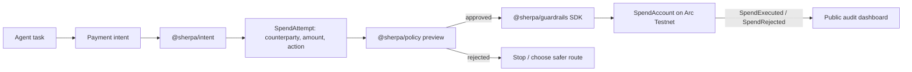

# Agent Payment Flow

Sherpa now has the same high-level flow as an agent product, not only a smart
contract demo.

## One-Line Flow

```text
Plain-English payment intent
-> parsed payment action
-> Sherpa policy decision
-> contract spend or typed rejection
-> dashboard/audit trail
```

## Runtime Flow



## Example Inputs

```text
Pay 8 USDC to the x402 API provider for vector search
Try to pay 60 USDC to the x402 API provider for premium data
Pay 5 USDC to the unknown vendor for a scraped lead list
```

## Example Outputs

```text
8 USDC -> x402 API Provider -> x402_vector_search -> APPROVED
60 USDC -> x402 API Provider -> paid_data_access -> REJECTED: PER_TX_CAP_EXCEEDED
5 USDC -> Unknown vendor -> unknown_vendor_payment -> REJECTED: COUNTERPARTY_BLOCKED
```

## API Surface

```text
POST /intent/parse
POST /intent/evaluate
POST /intent/demo
```

`/intent/parse` only extracts the payment fields. `/intent/evaluate` parses and
checks the policy. `/intent/demo` returns the full hackathon demo sequence.

## Demo Command

```bash
pnpm --filter sherpa-demo-agent start -- --dry-run
```

The dry run shows the complete agent loop without private keys. The live path
uses the same parsed intent, then sends the approved spend through the SDK to
the deployed `SpendAccount`. Rejected live attempts can also be submitted to
the contract, so `SpendRejected` appears in the on-chain audit trail.
