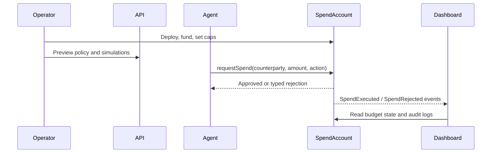

# Architecture

Sherpa Guardrails is structured as a product monorepo: contract settlement,
off-chain policy/simulation packages, API surface, dashboard, and demo agent.

```text
sherpa-guardrails/
├── apps/
│   ├── api/          HTTP API for policy evaluation and simulations
│   ├── agent/        Demo autonomous spending agent
│   └── dashboard/    Operator control plane and audit dashboard
├── packages/
│   ├── contracts/    Solidity SpendAccount and Foundry tests
│   ├── sdk/          TypeScript contract client and Arc event readers
│   ├── policy/       Off-chain policy mirror for previews and APIs
│   ├── audit/        Audit records and risk summaries
│   └── simulator/    Scenario runner for product demos and tests
├── scripts/          Arc connectivity and operational scripts
└── docs/             Product, deployment, security, and submission notes
```

## Data Flow



## Contract Boundary

The smart contract is the settlement gate. Off-chain services can preview,
simulate, and explain policy, but they cannot override contract limits.

## API Boundary

The API currently exposes read/simulation behavior:

- `GET /health`
- `GET /policy/demo`
- `POST /policy/evaluate`
- `POST /simulate/demo`
- `POST /simulate`

Future mutating operator actions should require wallet signatures and explicit
operator approval.
