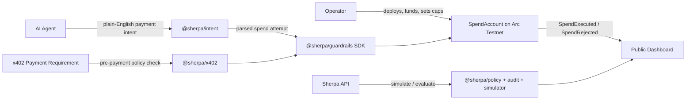

# Sherpa Guardrails PRD v1

## 1. One-Liner

Sherpa Guardrails is a smart-contract-backed spend manager that gives any AI
agent a verifiable USDC budget with hard caps enforced on-chain, counterparty
limits, and an auditable transaction trail.

## 2. Product Thesis

AI agents are moving from chat interfaces into operational systems that can
book services, pay APIs, buy data, call tools, and coordinate with other
agents. The missing primitive is not another wallet. It is a control layer that
lets an operator answer:

- How much can this agent spend today?
- Who can it pay?
- What happens when it tries to overspend?
- Can a counterparty verify the budget is real?
- Can the operator audit every spend attempt later?

Sherpa makes the budget the settlement rule. If a spend violates policy, the
smart contract rejects it before USDC moves.

## 3. Problem

### Operator Problem

Operators want to give agents financial autonomy, but normal wallets are too
powerful. A compromised prompt, loop, or dependency can drain funds if limits
live only in app logic.

### Agent Problem

Agents need a simple spend interface. They should not manage low-level contract
details, cap math, audit logs, and rejection handling on every payment.

### Counterparty Problem

APIs, tools, data sellers, and other agents need confidence that an autonomous
buyer has real budget and cannot later deny the spend path.

### Audit Problem

Autonomous spend needs a public trail. Today, many demos show happy-path
payments but do not clearly log rejected attempts, overspend attempts, or
operator controls.

## 4. Solution

Sherpa has six product layers:

| Layer | What It Does | Current Implementation |
| --- | --- | --- |
| Contract | Enforces budget before settlement | `SpendAccount`, `SpendAccountFactory` |
| SDK | Gives agents a drop-in spend client | `@sherpa/guardrails` |
| Intent | Turns plain-English payment requests into guarded spend attempts | `@sherpa/intent` |
| Policy API | Previews policy and simulations off-chain | `apps/api`, `@sherpa/policy` |
| Integrations | Guards x402-style payment requirements | `@sherpa/x402` |
| Dashboard | Shows budget, policy, audit trail, and risk | `apps/dashboard` on Vercel |

The agent receives a limited spender key. Funds remain inside the
`SpendAccount`. The only payment path is `requestSpend`, and the contract checks
per-transaction cap, daily cap, counterparty cap, pause/revoke state, and USDC
balance before transferring funds.

## 5. Target Users

### Primary: AI Agent Operators

Builders running autonomous agents that need to pay for APIs, compute, data,
tools, or other agents.

### Secondary: Agent Framework Developers

Developers who want a reusable spending primitive they can plug into their
agent runtime.

### Secondary: API And Tool Providers

Sellers that want autonomous agents to pay them, but only through a verifiable
and auditable budget path.

## 6. User Journey

```text
Operator creates a Sherpa spend account
-> funds it with USDC
-> sets daily, per-transaction, and counterparty caps
-> gives the agent a limited spender key
-> agent encounters a paid resource or x402 payment requirement
-> Sherpa checks policy
-> approved spend transfers USDC
-> over-cap or blocked spend emits rejection
-> dashboard shows all approved and rejected attempts
```

## 7. Architecture



## 8. Core Contract Requirements

### Functional Requirements

- Operator can deploy a spend account for one agent.
- Operator can set per-transaction and daily caps.
- Operator can allow or block counterparties.
- Operator can set per-counterparty daily caps.
- Agent can request spend to an allowed counterparty.
- Contract transfers USDC only if all checks pass.
- Contract emits `SpendExecuted` for approved spend.
- Contract emits `SpendRejected` for blocked spend.
- Operator can pause the account.
- Operator can revoke the agent.
- Operator can withdraw remaining funds.

### Current Contract Surface

```solidity
function setCaps(uint256 perTxCap_, uint256 dailyCap_) external onlyOperator;
function setCounterparty(address counterparty, bool allowed, uint256 dailyCap_) external onlyOperator;
function requestSpend(address counterparty, uint256 amount, bytes32 action)
    external
    returns (bool ok, RejectionReason reason);
function canAgentSpend(address counterparty, uint256 amount) external view returns (RejectionReason);
function remainingDailyCap() external view returns (uint256);
function remainingCounterpartyCap(address counterparty) external view returns (uint256);
function pause() external onlyOperator;
function unpause() external onlyOperator;
function revokeAgent() external onlyOperator;
function withdraw(address to, uint256 amount) external onlyOperator;
```

### Rejection Reasons

```text
NOT_AGENT
PAUSED
REVOKED
COUNTERPARTY_BLOCKED
ZERO_AMOUNT
PER_TX_CAP_EXCEEDED
DAILY_CAP_EXCEEDED
COUNTERPARTY_CAP_EXCEEDED
INSUFFICIENT_BALANCE
```

## 9. SDK Requirements

The SDK should hide contract complexity from the agent runtime.

### Current SDK Usage

```ts
import { createGuardrailsClient } from "@sherpa/guardrails";

const sherpa = createGuardrailsClient({
  accountAddress,
  account: agentSigner,
  rpcUrl,
});

await sherpa.spend({
  counterparty,
  amountUsdc: "8",
  action: "x402_api_call",
});

await sherpa.state();
await sherpa.counterpartyState(counterparty);
await sherpa.auditEvents({ fromBlock });
```

### SDK Responsibilities

- Convert human USDC amounts to base units.
- Pre-check spend with contract read calls.
- Submit spend requests from agent key.
- Return typed approval/rejection result.
- Read budget state.
- Read counterparty state.
- Read approved/rejected audit events.

## 10. Agent Behavior

Sherpa should be demonstrated as an agent, not just a button-driven contract
demo.

### Demo Agent Goal

The agent needs to complete a task that requires paid API/tool access.

### Agent Loop

```text
1. Receive task.
2. Detect paid resource requirement or natural-language payment intent.
3. Parse the intent into amount, counterparty, and action.
4. Ask Sherpa whether payment is allowed.
5. If allowed, call spend and continue.
6. If rejected, stop or choose cheaper/allowed route.
7. Emit trace for dashboard/audit.
```

### Demo Moment

```text
Budget: 50 USDC/day
Per transaction cap: 10 USDC
Allowed counterparty: x402 API provider

Spend 1: 8 USDC -> approved
Spend 2: 60 USDC -> rejected
Spend 3: 5 USDC to unknown vendor -> rejected
```

## 11. x402 Composability

Sherpa does not replace x402. x402 handles the HTTP-native payment handshake.
Sherpa is the guardrail before an agent pays.

### Flow

```text
Agent requests paid resource
-> service returns 402 Payment Required
-> Sherpa parses payment requirement
-> Sherpa maps requirement to spend attempt
-> policy approves or rejects
-> agent only proceeds if Sherpa allows it
```

### Current Package

```text
packages/x402
```

Capabilities:

- parse payment requirement headers
- serialize x402-style payment requirements
- map x402 requirement to Sherpa spend attempt
- approve/reject before payment execution
- expose API route through `POST /x402/guard`

## 12. Dashboard Requirements

The dashboard should make the product understandable in under 20 seconds.

### Required Views

- Daily budget
- Settled spend
- Remaining cap
- Rejected risk
- Policy engine status
- Counterparty allowance
- Approved/rejected audit trail
- Agent simulation
- SDK handoff snippet

### Current Preview

```text
https://sherpa-guardrails-j3x8jgrop-gnanam1990s-projects.vercel.app
```

## 13. API Requirements

The API supports previews, simulations, and integration checks.

### Current Routes

```text
GET  /health
GET  /policy/demo
POST /intent/parse
POST /intent/evaluate
POST /intent/demo
POST /policy/evaluate
POST /simulate/demo
POST /simulate
POST /x402/guard
```

### Non-Goals For API In Sprint

- No mutation of live contract policy from unauthenticated API.
- No private key custody.
- No automatic funding.

## 14. Sprint Deliverables

| Day | Deliverable | Status |
| --- | --- | --- |
| Mon | Contract, tests, repo scaffold | Done |
| Tue | SDK, deployment scripts, demo agent | Done |
| Wed | Dashboard preview, product brief, MVP submission assets | Done |
| Thu | API, policy/audit/simulator packages, x402 guardrails | Done |
| Fri | Live Arc deploy, demo video, final polish | Pending credentials |

## 15. Success Criteria

### MVP Success

- Contract tests pass.
- SDK tests pass.
- Demo agent shows approval and rejection.
- Dashboard is publicly accessible.
- x402 guardrail route approves/rejects requirements.
- Repo has clear docs and deployment path.

### Final Demo Success

- Contract deployed on Arc Testnet.
- Spend account funded with test USDC.
- Agent performs an approved spend.
- Agent attempts an overrun and receives contract-level rejection.
- Dashboard reads live deployed account events.
- Demo video captures the full loop.

## 16. Metrics

- Prevented-risk value: total rejected attempted spend.
- Settled spend: approved USDC volume.
- Rejection rate: rejected attempts / total attempts.
- Policy coverage: percentage of spend attempts with cap and counterparty checks.
- Time to integrate: minutes from SDK install to first guarded spend.

## 17. Risks And Mitigations

| Risk | Impact | Mitigation |
| --- | --- | --- |
| Agent key compromise | Unauthorized spend attempts | per-tx cap, daily cap, revoke |
| Counterparty spoofing | Agent pays wrong address | allowlist and counterparty caps |
| App-layer bypass | Agent skips SDK | funds only move through contract |
| Reverted events disappear | No rejection proof | non-reverting `SpendRejected` path |
| Mainnet safety | Real funds at risk | Arc Testnet only for sprint |
| Missing live credentials | No on-chain final demo | readiness script and wallet generator |

## 18. Current Status

Built:

- `SpendAccount` contract
- `SpendAccountFactory`
- Foundry tests
- `@sherpa/guardrails` SDK
- demo agent
- dashboard preview
- API
- policy package
- intent package
- audit package
- simulator package
- x402 guardrails package
- Agent Hub-style manifest
- Vercel preview
- deployment/readiness scripts

Pending:

- funded Arc Testnet deployer wallet
- live contract deployment
- live spend account funding
- live approved transaction
- live rejected transaction
- dashboard connected to deployed account
- demo recording

## 19. Roadmap

### Stage 1: Hackathon MVP

Contract, SDK, demo agent, dashboard, API, x402 guardrails.

### Stage 2: Live Arc Demo

Deploy and fund a real Arc Testnet spend account, run the agent, capture live
audit events.

### Stage 3: Operator Console

Wallet connect, set caps, pause, revoke, withdraw, and refresh audit events
from the UI.

### Stage 4: Multi-Agent Treasury

One operator manages many agents with separate budgets and shared treasury
rules.

### Stage 5: Production Hardening

Multisig operators, formal audit, monitoring, alerting, and mainnet readiness
review.

## 20. Positioning

Sherpa is the corporate card for autonomous agents:

- budgets are verifiable
- caps are enforced before settlement
- counterparties are controlled
- rejected attempts are visible
- the agent never gets unrestricted custody

The product is not “an agent wallet.” It is the spend-governance layer agents
need before operators can safely let them transact.
