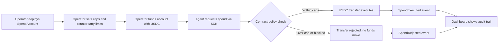

# Wednesday Checkpoint Package

## Product Brief

Sherpa Guardrails is a smart-contract-backed spend manager for autonomous AI
agents. Operators fund an agent spend account with USDC, set hard budgets, and
give the agent a limited spender key. The agent can request payments only
through the contract. Valid spend executes; over-budget spend is rejected by
the contract and recorded as an on-chain audit event.

## One-Page Pitch

### Problem

AI agents are starting to pay for APIs, compute, data, and other agents. Today,
operators either hand the agent a normal wallet or enforce limits in app code.
If the agent loops, gets prompt-injected, or runs compromised code, those
off-chain checks can fail.

### Solution

Sherpa moves spend governance into a smart contract. The agent never has direct
custody of the full budget. It can only call `requestSpend`, and the
`SpendAccount` enforces per-transaction caps, daily caps, per-counterparty
limits, pause/revoke controls, and USDC balance checks before funds move.

### Why Now

Agentic commerce is moving from demos to real payments. Stablecoin rails make
machine-to-machine payments practical, but teams need a control plane before
they trust autonomous agents with money.

### MVP

- `SpendAccount` and `SpendAccountFactory` contracts
- Foundry tests for caps, rejection reasons, pause, revoke, withdrawal, and day
  rollover
- TypeScript SDK for agent frameworks
- Demo agent with an approved 8 USDC spend and rejected 60 USDC overrun
- Dashboard preview/live mode for budget state and audit events
- Arc Testnet deployment and demo operation scripts

### Demo Claim

An operator gives an agent a 50 USDC daily budget and a 10 USDC per-transaction
cap. The agent successfully spends 8 USDC to an API provider. When it tries to
spend 60 USDC, the smart contract rejects the request, moves no funds, and
emits a typed rejection event for the dashboard.

### Differentiation

Most agent spend controls are app-layer policies. Sherpa makes the policy the
settlement gate. If the contract says no, the money cannot move.

## User Flow

## MVP Screenshot Checklist

- Contract test output: `pnpm contracts:test`
- SDK test output: `pnpm --filter @sherpa/guardrails test`
- Demo agent dry-run: `pnpm --filter sherpa-demo-agent start -- --dry-run`
- Dashboard preview: `pnpm --filter sherpa-dashboard dev`
- Live dashboard mode after deployment with `VITE_SPEND_ACCOUNT_ADDRESS`
- GitHub commit history showing build progress during the sprint

## Rubric Alignment

- Technical execution: contract-enforced caps, typed SDK, event readers, tests
- Usefulness: gives operators a real control plane before agents spend money
- Creativity: turns agent budgets into settlement-level guardrails
- Codex usage: repo scaffolding, implementation, debugging, tests, docs, demo
- Presentation clarity: one-line demo story with visible approved/rejected proof

## Submission Links

- Repository: `https://github.com/gnanam1990/sherpa-guardrails`
- Prototype: `https://sherpa-guardrails-j3x8jgrop-gnanam1990s-projects.vercel.app`
- Demo video: add Loom/YouTube URL after recording
- Public launch post: add LinkedIn/X URL after posting

## Current Status

- Contracts: built and tested locally
- SDK: builds, tests, and reads contract state/audit events
- Demo agent: dry-run working; live mode ready for deployed account
- Dashboard: preview working; live mode ready for deployed account
- Remaining: deploy to Arc Testnet, fund account, capture live demo, deploy
  dashboard, polish final UI and launch copy
